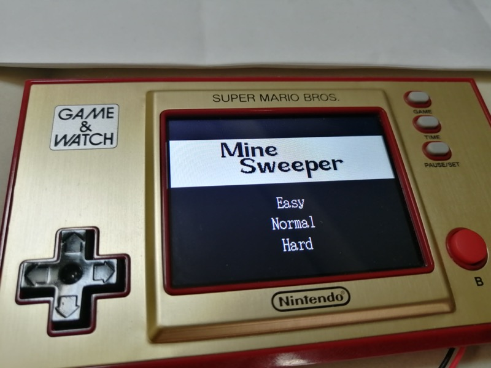
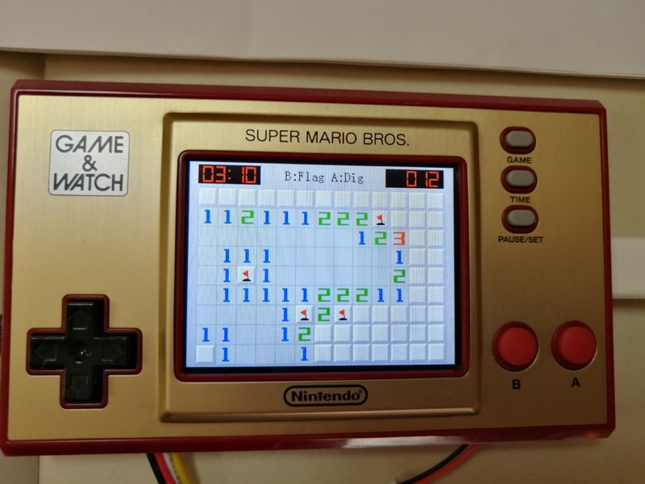
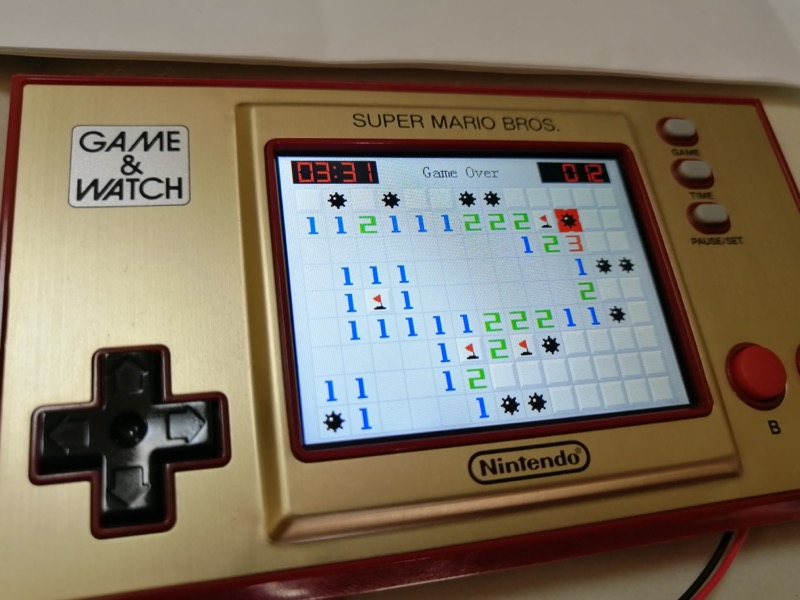
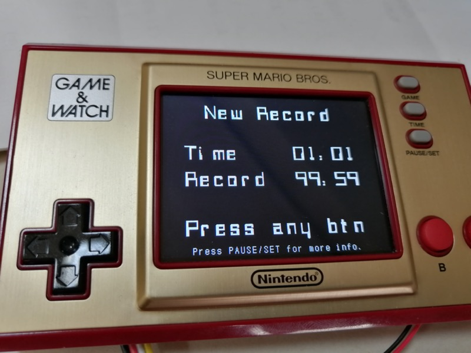

# Mine game for Nintendo Game &amp; Watch
This is a mine-sweeper game runs on the Nintendo Game &amp; Watch: Super Mario Bros / Zelda system.

## Before build
You need backup your G&W first. See [game-and-watch-backup](https://github.com/ghidraninja/game-and-watch-backup)
## 1. Build / Flash in command line
Build and flash by `make flash` in `game-and-watch-mine-sweeper` directory

## 2. Build / Flash / Debug with STM32CubeIDE
Import this project into your STM32CubeIDE workspace by `Import -> General -> Existing Projects into Workspace` and build / debug it.

## 3. Just need the game rom
You can just download Pre builded elf file for test.
- [ROM .elf](./Release/ROM/gw_mine_sweeper.elf)
- [RAM .elf](./Release/RAM/gw_mine_sweeper.elf)

## Controls
- Select a level at home page and press A to start game.
- Button A for dig, B for flag.
- If a digit block already has enough flags next to it. You can dig(A) on it for clear all blocks around it.
- Power off (sleep) by press power button.

## Pictures
- 
- 
- 
- 

## Tasks
- Some simple sound
- Save hi-score
- Screen bright

## Thanks
- This project is based on [game-and-watch-base](https://github.com/ghidraninja/game-and-watch-base).
- This project use some code (power down etc.) from [game-and-watch-retro-go](https://github.com/kbeckmann/game-and-watch-retro-go).
- Thanks _tim_ in [discord](https://discord.gg/Zks9wsscK3) for many helps. He also create a page which lists a lot of fun thing with G&W, you can take a look if you like, [Here is it](https://www.schuerewegen.tk/gnw/)